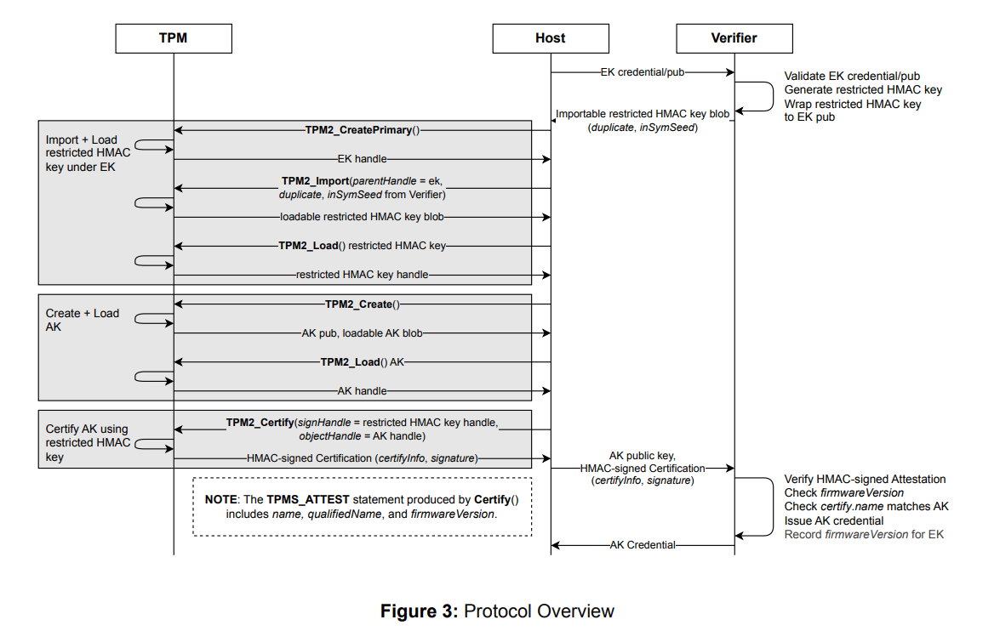

### EK-Based Key Attestation with TPM Firmware Version


Simple demo of [EK-Based Key Attestation with TPM Firmware Version](https://trustedcomputinggroup.org/wp-content/uploads/EK-Based-Key-Attestation-with-TPM-Firmware-Version-Version-1_Pub.pdf)





```bash
rm -rf /tmp/myvtpm && mkdir /tmp/myvtpm && swtpm_setup --tpmstate /tmp/myvtpm --tpm2 --create-ek-cert && swtpm socket --tpmstate dir=/tmp/myvtpm --tpm2 --server type=tcp,port=2321 --ctrl type=tcp,port=2322 --flags not-need-init,startup-clear --log level=2

export TPM2TOOLS_TCTI="swtpm:port=2321"


$ go run main.go 
2026/04/16 16:50:30 ======= create ekPublic on Attestor  ========
2026/04/16 16:50:30 ======= EK ========
2026/04/16 16:50:30 Name 000b90b36864964f9ecf5fce75319f622c44a2d8e2e835c8576e3d60d1d5905a1dc2
2026/04/16 16:50:30 RSA EK createPrimary public 
-----BEGIN PUBLIC KEY-----
MIIBIjANBgkqhkiG9w0BAQEFAAOCAQ8AMIIBCgKCAQEA2vyQ55UcNjMG2QNML6z+
GbJw9mZXsXhCHYVZ3n8ccCyRahHHGHNWOgi/LFRe7MDXTDMXteYhFFmZDbUOeNng
NpUtQTwzyQL8eKx4gXSn6xSnyPzjE05zLByOtE86Y8FqW1uCtN4jXp1cj6xZ+9LB
Fjr8J/0boluCdF2ymFBqoLZU2sxekem18ON1CrT0jIA0zNQAmJ0oOoQ5iu/C1pI0
Zcb5UyPKvopby6xX85Hhb1UaKO+KVMOplsBLdFDEVd5icdELFdmqJUpF1RkhbGBr
ow3I5f9+k6iDzO4Jzl6o5bRFwi8korbTEIo4iGhx/XghrmWdPAddc4tLquW3IW3/
lwIDAQAB
-----END PUBLIC KEY-----

2026/04/16 16:50:30 ======= send the ekPub.PEM to the Verifier ========
2026/04/16 16:50:30 ======= create a random HMAC key and duplicate it ========
duplicateTemplate Name 000b4b100bd0c4a6cd7a32e20312ac23353c2662ccf6644cb3ab1d6da415e4f0e2f6
2026/04/16 16:50:30 ======= verifier send duplicate key, duplicate seed and duplicate pub to Attestor ========
2026/04/16 16:50:30 ======= Attestor creates  EK ========
2026/04/16 16:50:30 RSA createPrimary public 
-----BEGIN PUBLIC KEY-----
MIIBIjANBgkqhkiG9w0BAQEFAAOCAQ8AMIIBCgKCAQEA2vyQ55UcNjMG2QNML6z+
GbJw9mZXsXhCHYVZ3n8ccCyRahHHGHNWOgi/LFRe7MDXTDMXteYhFFmZDbUOeNng
NpUtQTwzyQL8eKx4gXSn6xSnyPzjE05zLByOtE86Y8FqW1uCtN4jXp1cj6xZ+9LB
Fjr8J/0boluCdF2ymFBqoLZU2sxekem18ON1CrT0jIA0zNQAmJ0oOoQ5iu/C1pI0
Zcb5UyPKvopby6xX85Hhb1UaKO+KVMOplsBLdFDEVd5icdELFdmqJUpF1RkhbGBr
ow3I5f9+k6iDzO4Jzl6o5bRFwi8korbTEIo4iGhx/XghrmWdPAddc4tLquW3IW3/
lwIDAQAB
-----END PUBLIC KEY-----

2026/04/16 16:50:30 ======= Attestor imports the duplicated hmac key ========
2026/04/16 16:50:30 ======= Attestor creates AK ========
2026/04/16 16:50:30 Created AK Name :000bc81d2b561077aacac387d6076eef08d9f15102a99c0091eb7115db9da66a6570
2026/04/16 16:50:30 RSA Key 
-----BEGIN PUBLIC KEY-----
MIIBIjANBgkqhkiG9w0BAQEFAAOCAQ8AMIIBCgKCAQEAkz6vT0Mx2nmvVa97g/IM
714nF+bDdcEXcHifImp5m3zeKKfwhlrI/0gJBxadhfJTp3+RRcueahg0owGt43nR
EyKsfJ8KgDlB5wBDflI6GLko3f76Vp8F97bCvDHmfWrurKHwZ4gNuxm7gFXaKbpN
Knw4z3HyZwwRaWNVjmUI6cGjGxkAnpzn+Mrp9os463JaD8fPVfUWrkQaIt3O/OB5
NR/jDC/OCQsSAPCFXhPOIb39QqJdZGKx45OuQsFcjEIUqfka4cXF95SFaFJbtx++
zGRbk0L1htPzdSMIwwXU+2i/2Z6VZ3Dd6xRYZ7AkcCocgsYrWYJC9EUDVYf5Zg8F
MQIDAQAB
-----END PUBLIC KEY-----

2026/04/16 16:50:30 ======= Attestor certifies ak with the duplicated key ========
2026/04/16 16:50:30 ======= Attestor sends attestation signature and attestation to Verifier ========
2026/04/16 16:50:30 Certify Response of Signature 
nSxEA6HQeQW5cD3jQ9zYxhmJtJ+mcqI9AzM9dzFFHss=
2026/04/16 16:50:30 ======= verifier checks attesatation certification info specifications ========
2026/04/16 16:50:30 Certify Firmware Version 2315977366801874944
2026/04/16 16:50:30 Certify AK Name 000bc81d2b561077aacac387d6076eef08d9f15102a99c0091eb7115db9da66a6570
2026/04/16 16:50:30 Certify Extra Data 
2026/04/16 16:50:30 ======= Attestor verifies the HMAC signature of the attesation certification info  ========
nSxEA6HQeQW5cD3jQ9zYxhmJtJ+mcqI9AzM9dzFFHss=
2026/04/16 16:50:30 attestation verified

```
