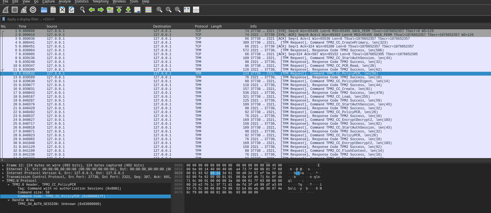
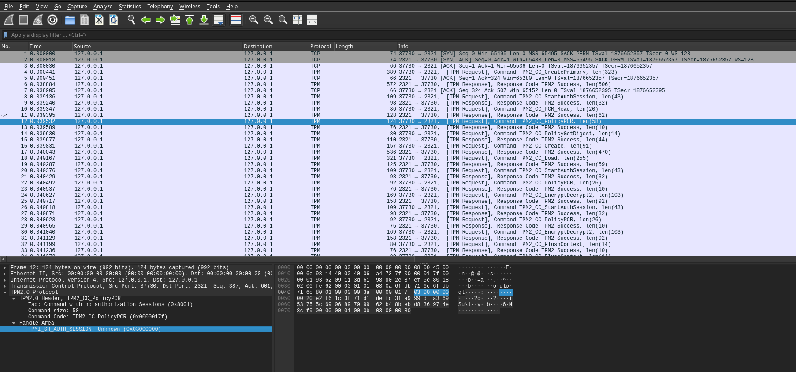
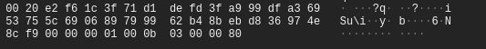

### Reconstruct Policy using command parameters

Sample which reconstructs a known policy using raw command parameters:

The usecase for this is to regenerate a policy using just the command parameters as described in [TPMPolicy Syntax](https://www.hansenpartnership.com/draft-bottomley-tpm2-keys.html#section-4.1)

For example, the following PEM TPM key uses a PCR policy (code `tpm2.TPMCCPolicyPCR 017F` and `tpm2.TPMCCPolicyAuthValue 016B`)

The `tpm2.TPMCCPolicyPCR` command parameters are described in [23.7 TPM2_PolicyPCR](https://trustedcomputinggroup.org/wp-content/uploads/TPM-Rev-2.0-Part-3-Commands-01.38.pdf) and is basically a concat of `TPM2B_DIGEST` with `TPML_PCR_SELECTION`

The structure below shows the encoded parameters for a PEM TPM key which has both PCR and PolicyAuthValue: 

```bash
$ cat private.pem 
-----BEGIN TSS2 PRIVATE KEY-----
MIICdwYGZ4EFCgEDoUYwRDA2oAQCAgF/oS4ELAAg4vYcP3HR3v0/qZnfo2lTdVxp
Bol5mWK0i+vYNpdOjPkAAAABAAsDAACAMAqgBAICAWuhAgQAAgRAAAABBIIBOgE4
AAEACwAEAHIAIDTiKp2k1c5wQVDv/Wf7aZTVz6Gm4qBKpFFAk/D00xnQABAAFAAL
CAAAAQABAQCsgvEU2ZGQNxfEypDU0TAXvaTxl3cUzRjU4RTr5vIJUILUpsB5gGtB
WAzT/9fMYcq5vO6oImt6/vIlhPnyHNXrkSHW9f3uOg6Pj8fXBzCl1X4YCHcn6VG1
JrE5NR41TSwgnDG7Y1o8NRXCVo+KbKiYD/Mv2R4qZUKNgIL62VfDSy1B3QoxJWHv
5BFHKFx9ENkaiU0Cs97wuxVb+qsPV4Tq57K3gi3NvHW2nrLun5aPg6JzHRo7Bt7g
f3qWE+8eNfO0UZcA6fxOoQLcHyGTxMReBkzTm/he/BLyfMdotYyu2jehUuUpoaZ0
XrQtPrluxogLk30P5u+9Mcud3ade0jSbBIHgAN4AIK3f+hAg2xs7t1/rhf9tvXpj
p+3UMKRes8WlABEebnIHABBbv2yNzogHpRtejGqw5H7PqhKU7rNoSf7dqTEXeOzS
LMlr6nSapSZqO/8yu8LMCcG4euNcmrgcuw3Ctx9hlqO4A/QwxCsS4Wn5fpgQuPuD
0fO2dk1VXlt1jbXXaAoRArZ1UsvuJTZxTeDK3CxVVD4kfYLygaZigDLz4dT1SbK/
kU6pMoobhvKS6Mjw0uU3pseNH/0PEAIRBIsFe1O5jDrMbBq578z5ko7oKnpa2CMR
9rZ6PguH9mF8dgI=
-----END TSS2 PRIVATE KEY-----


## which when decoded:

$ openssl asn1parse -inform PEM -in private.pem
    0:d=0  hl=4 l= 631 cons: SEQUENCE          
    4:d=1  hl=2 l=   6 prim: OBJECT            :2.23.133.10.1.3
   12:d=1  hl=2 l=  70 cons: cont [ 1 ]        
   14:d=2  hl=2 l=  68 cons: SEQUENCE          
   16:d=3  hl=2 l=  54 cons: SEQUENCE          
   18:d=4  hl=2 l=   4 cons: cont [ 0 ]        
   20:d=5  hl=2 l=   2 prim: INTEGER           :017F
   24:d=4  hl=2 l=  46 cons: cont [ 1 ]        
   26:d=5  hl=2 l=  44 prim: OCTET STRING      [HEX DUMP]:0020E2F61C3F71D1DEFD3FA999DFA36953755C690689799962B48BEBD836974E8CF900000001000B03000080
   72:d=3  hl=2 l=  10 cons: SEQUENCE          
   74:d=4  hl=2 l=   4 cons: cont [ 0 ]        
   76:d=5  hl=2 l=   2 prim: INTEGER           :016B
   80:d=4  hl=2 l=   2 cons: cont [ 1 ]        
   82:d=5  hl=2 l=   0 prim: OCTET STRING      
   84:d=1  hl=2 l=   4 prim: INTEGER           :40000001
   90:d=1  hl=4 l= 314 prim: OCTET STRING      [HEX DUMP]:01380001000B00040072002034E22A9DA4D5CE704150EFFD67FB6994D5CFA1A6E2A04AA4514093F0F4D319D000100014000B0800000100010100AC82F114D991903717C4CA90D4D13017BDA4F1977714CD18D4E114EBE6F2095082D4A6C079806B41580CD3FFD7CC61CAB9BCEEA8226B7AFEF22584F9F21CD5EB9121D6F5FDEE3A0E8F8FC7D70730A5D57E18087727E951B526B139351E354D2C209C31BB635A3C3515C2568F8A6CA8980FF32FD91E2A65428D8082FAD957C34B2D41DD0A312561EFE41147285C7D10D91A894D02B3DEF0BB155BFAAB0F5784EAE7B2B7822DCDBC75B69EB2EE9F968F83A2731D1A3B06DEE07F7A9613EF1E35F3B4519700E9FC4EA102DC1F2193C4C45E064CD39BF85EFC12F27CC768B58CAEDA37A152E529A1A6745EB42D3EB96EC6880B937D0FE6EFBD31CB9DDDA75ED2349B
  408:d=1  hl=3 l= 224 prim: OCTET STRING      [HEX DUMP]:00DE0020ADDFFA1020DB1B3BB75FEB85FF6DBD7A63A7EDD430A45EB3C5A500111E6E720700105BBF6C8DCE8807A51B5E8C6AB0E47ECFAA1294EEB36849FEDDA9311778ECD22CC96BEA749AA5266A3BFF32BBC2CC09C1B87AE35C9AB81CBB0DC2B71F6196A3B803F430C42B12E169F97E9810B8FB83D1F3B6764D555E5B758DB5D7680A1102B67552CBEE2536714DE0CADC2C55543E247D82F281A6628032F3E1D4F549B2BF914EA9328A1B86F292E8C8F0D2E537A6C78D1FFD0F100211048B057B53B98C3ACC6C1AB9EFCCF9928EE82A7A5AD82311F6B67A3E0B87F6617C7602

```

so given that  `0020E2F61C3F71D1DEFD3FA999DFA36953755C690689799962B48BEBD836974E8CF900000001000B03000080` represents the PCRPolicy parameters, to convert that to go-tpm `PolicyPCR`

```golang
	// TPM2BDigest struct section 10.4.2 https://trustedcomputinggroup.org/wp-content/uploads/TPM-Rev-2.0-Part-2-Structures-01.38.pdf
	//    size UINT16
	//    buffer[size]{:sizeof(TPMU_HA)} BYTE

	// get the length of the digest, first 2bytes is length of buffer
    commandParameter := "0020e2f61c3f71d1defd3fa999dfa36953755c690689799962b48bebd836974e8cf900000001000b03000080"

	l := binary.BigEndian.Uint16(commandParameter[:2])
	dgst := commandParameter[:l+2]

	d, err := tpm2.Unmarshal[tpm2.TPM2BDigest](dgst)
	t, err := tpm2.Unmarshal[tpm2.TPMLPCRSelection](commandParameter[l+2:])

	_, err = tpm2.PolicyPCR{
		PolicySession: sess2.Handle(),
		PcrDigest:     *d,
		Pcrs:          *t,
	}.Execute(rwr)
```


For a live demo, run a swtpm, then increment pcr23

```bash
rm -rf /tmp/myvtpm && mkdir /tmp/myvtpm  && \
    sudo swtpm_setup --tpmstate /tmp/myvtpm --tpm2 --create-ek-cert && \
    sudo swtpm socket --tpmstate dir=/tmp/myvtpm --tpm2 --server type=tcp,port=2321 --ctrl type=tcp,port=2322 --flags not-need-init,startup-clear --log level=2

export TPM2TOOLS_TCTI="swtpm:port=2321"
tpm2_pcrextend 23:sha256=0x0000000000000000000000000000000000000000000000000000000000000000
tpm2_flushcontext -t &&  tpm2_flushcontext -s  &&  tpm2_flushcontext -l
tpm2_pcrread sha256:23
  sha256:
    23: 0xF5A5FD42D16A20302798EF6ED309979B43003D2320D9F0E8EA9831A92759FB4B

## create H2 Template
printf '\x00\x00' > /tmp/unique.dat
tpm2_createprimary -C o -G ecc  -g sha256 \
     -c primary.ctx \
     -a "fixedtpm|fixedparent|sensitivedataorigin|userwithauth|noda|restricted|decrypt" -u /tmp/unique.dat
tpm2_flushcontext -t && tpm2_flushcontext -s && tpm2_flushcontext -l  

tpm2_startauthsession --policy-session -S session.dat
tpm2_pcrread sha256:23 -o pcr23_val.bin
tpm2_policypcr -S session.dat -l sha256:23  -L policy.dat -f pcr23_val.bin
tpm2_policyauthvalue -S session.dat -L policy.dat
tpm2_flushcontext -t && tpm2_flushcontext -s && tpm2_flushcontext -l  

tpm2_create -g sha256 -G aes128cfb -u key.pub -r key.prv -C primary.ctx -L policy.dat  -p foo
tpm2_flushcontext -t && tpm2_flushcontext -s && tpm2_flushcontext -l  
tpm2_load -C primary.ctx -u key.pub -r key.prv -n key.name -c key.ctx    
```

As wire format using `sudo tcpdump -s0 -ilo -w trace.cap port 2321`, the command is:



The auth session is:


and finally the paramters on the wire

```
 SWTPM_IO_Read: length 58
 80 01 00 00 00 3A 00 00 01 7F 03 00 00 01 [[>>  00 20 
 E2 F6 1C 3F 71 D1 DE FD 3F A9 99 DF A3 69 53 75 
 5C 69 06 89 79 99 62 B4 8B EB D8 36 97 4E 8C F9 
 00 00 00 01 00 0B 03 00 00 80 << ]]
```




to use wireshark, run  `wireshark trace.cap`

To run as a go sample:

```bash
$ go run main.go 
    2024/10/11 21:31:19 ======= createPrimary ========
    2024/10/11 21:31:19 ======= create ========
    2024/10/11 21:31:19 pcrSelectionSegment 00000001000b03000080
    2024/10/11 21:31:19 pcrDigestSegment 0020e2f61c3f71d1defd3fa999dfa36953755c690689799962b48bebd836974e8cf9
    2024/10/11 21:31:19 commandParameter 0020e2f61c3f71d1defd3fa999dfa36953755c690689799962b48bebd836974e8cf900000001000b03000080

    2024/10/11 21:31:19 IV: ce804be23e63021a0ced77c4b3d23bd9
    2024/10/11 21:31:19 Encrypted 528661db24
    2024/10/11 21:31:19 Decrypted foooo
```