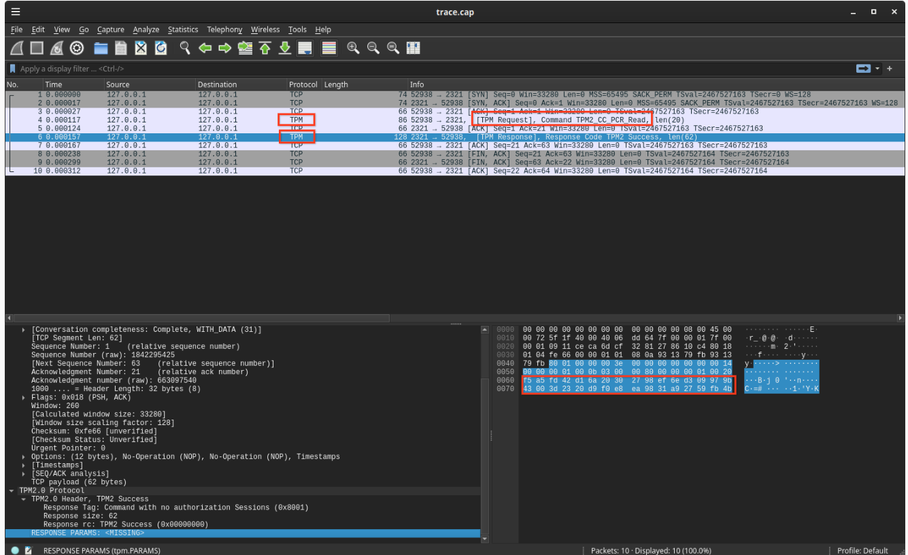
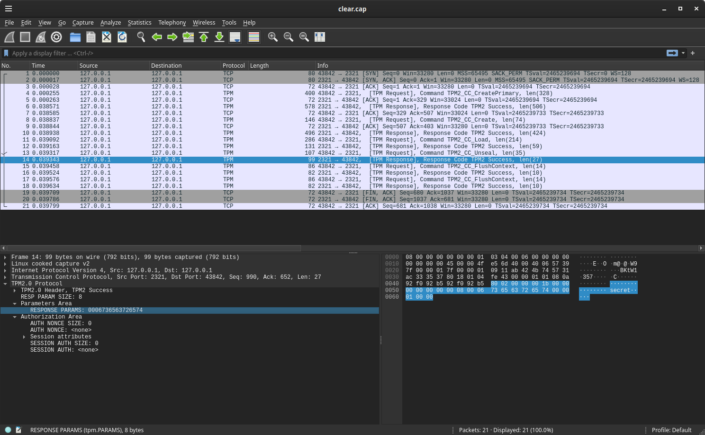

### Using software TPM (swtpm) to trace API calls with TCPDump


If you want to capture raw API calls with software TPM, start it first as a socket

```bash
mkdir /tmp/myvtpm

sudo swtpm socket --tpmstate dir=/tmp/myvtpm --tpm2 --server type=tcp,port=2321 --ctrl type=tcp,port=2322 --flags not-need-init,startup-clear
```

To verify connectivity with `tpm2_tools`:

```bash
export TPM2TOOLS_TCTI="swtpm:port=2321"
tpm2_pcrread sha256:23
  sha256:
    23: 0x0000000000000000000000000000000000000000000000000000000000000000

tpm2_pcrextend 23:sha256=0x0000000000000000000000000000000000000000000000000000000000000000

tpm2_pcrread sha256:23
  sha256:
    23: 0xF5A5FD42D16A20302798EF6ED309979B43003D2320D9F0E8EA9831A92759FB4B
```


To capture a command trace, run `tcpdump`

```bash
sudo tcpdump -s0 -ilo -w trace.cap port 2321
```

In our code, open as a tcp connection:

```golang
package main

import (
	"github.com/google/go-tpm-tools/simulator"
	"github.com/google/go-tpm/tpm2"
	"github.com/google/go-tpm/tpm2/transport"
	"github.com/google/go-tpm/tpmutil"
)

var TPMDEVICES = []string{"/dev/tpm0", "/dev/tpmrm0"}

func OpenTPM(path string) (io.ReadWriteCloser, error) {
	if slices.Contains(TPMDEVICES, path) {
		return tpmutil.OpenTPM(path)
	} else if path == "simulator" {
		return simulator.GetWithFixedSeedInsecure(1073741825)
	} else {
		return net.Dial("tcp", path)
	}
}

func main() {
	rwc, err := OpenTPM("127.0.0.1:2321")
	if err != nil {
		log.Fatalf("can't open TPM  %v", err)
	}
	defer func() {
		rwc.Close()
	}()

	rwr := transport.FromReadWriter(rwc)
}

```


then open up the trace in wireshark

```bash
wireshark trace.cap
```

you can see the command request and responses.  It seems the pcrread command dissector doesn't show the responses that cleanly:



compare that with unseal 



where the highlighted bit is what i unsealed (`0006736563726574` --> `secret`)

