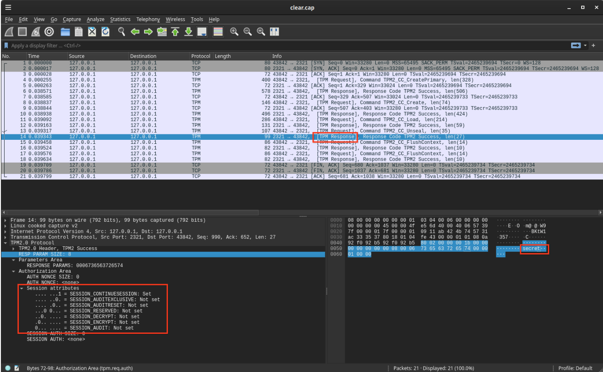
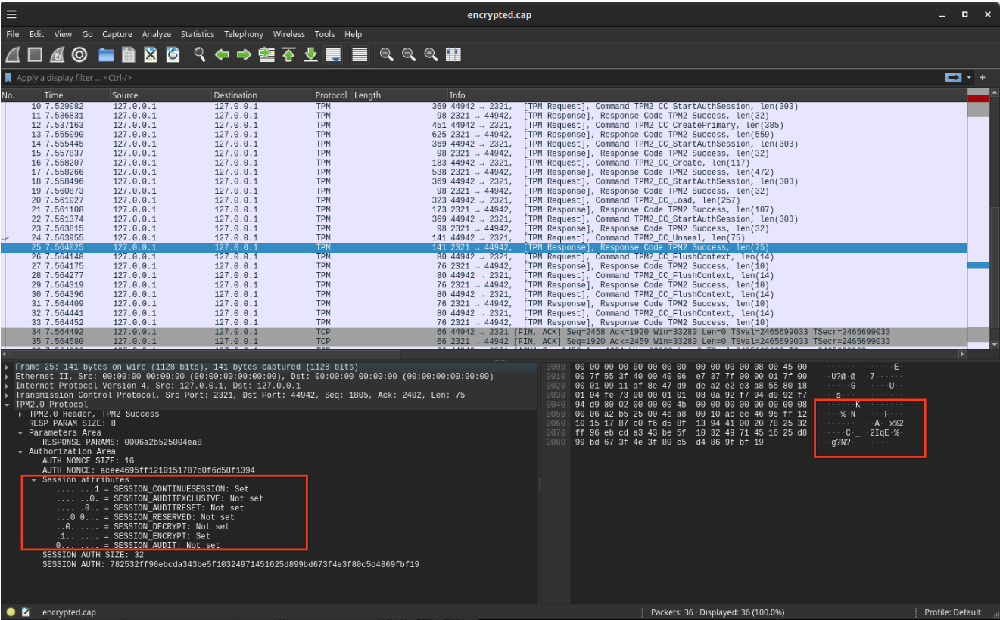

### Session Encryption

Sample demonstrates how to setup session encryption.

Basically this encrypts the data in transit in a way that sniffing low level bus traffic does not show the secrets (like end-to-end encryption).

See:

- [CPU to TPM Bus Protection Guidance](https://trustedcomputinggroup.org/wp-content/uploads/TCG_CPU_TPM_Bus_Protection_Guidance_Passive_Attack_Mitigation_8May23-3.pdf)
- [Protecting Secrets At Tpm Interface](https://tpm2-software.github.io/2021/02/17/Protecting-secrets-at-TPM-interface.html)


The two snippets below this section uses seal/unseal to encode and read back a secret.

This uses a swtpm simulator running on a tcp port.  It also uses `tcpdump` to capture the application->TPM traffic which we can decode with wireshark.


First one run in clear text without encryption and you can see the 'unseal' data in clear text

The second one we run with session encryption set so the data is still encrypted in transit


To use, run the simulator

```bash
mkdir /tmp/myvtpm
swtpm socket --tpmstate dir=/tmp/myvtpm --tpm2 --server type=tcp,port=2321 --ctrl type=tcp,port=2322 --flags not-need-init,startup-clear
```

In a new window, test

```bash
export TPM2TOOLS_TCTI="swtpm:port=2321"
tpm2_pcrread

sudo tcpdump -s0 -ilo -w trace.cap port 2321
```

Now

#### Seal/Unseal without session encryption

You'll see the raw data




### Seal/Unseal with session encryption

you'll see the encrypted data



